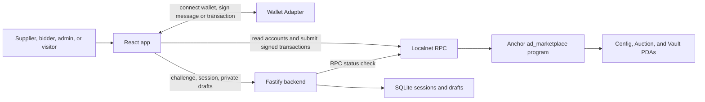

# Ad Marketplace: Actor Journeys and System Behavior

This guide describes the **current implementation** for a product walkthrough
or technical presentation. It follows each actor from the browser and wallet
adapter through JavaScript, the backend or Solana RPC, and the resulting
application state. It also calls out behavior that is not implemented.

The demo is Localnet-only. For container, build, deployment, and wallet funding
commands, see the [workspace README](../README.md).

## 1. The product in one minute

The app has two deliberately separate listing paths:

1. **Active on-chain auction:** a supplier creates an Auction PDA from the
   Localnet panel. The program holds the current leading bid in a vault PDA,
   refunds an outbid leader immediately, and makes completed-cycle proceeds
   claimable by the supplier.
2. **Off-chain draft:** a signed-in wallet saves private planning information
   through the backend. A draft is not published, is not an Auction PDA, and
   cannot receive bids.

The supplier's initial close time starts a recurring auction schedule; it is
not a final listing expiry. Cycle changes are **lazy**: a later successful
`place_bid` or `claim_funds` transaction observes an elapsed deadline and
settles the cycle. Nothing runs automatically at the deadline.

## 2. Actors and trust boundaries

| Actor | How the app identifies them | Main actions | What that identity does not prove |
| --- | --- | --- | --- |
| Visitor | No wallet required for public on-chain reads | Browse public auctions and status | Nothing; browsing is read-only |
| Supplier | The wallet signing `create_listing` | Create an auction and later claim its settled funds | The wallet signature does not prove the supplier's legal-business identity |
| Bidder | The wallet signing `place_bid` | Escrow a bid and provide the ad-image URL for that bid | A bid is not a buyout or a historical bid record |
| Marketplace admin | `Config.admin`, set by the first `initialize_config` transaction | Verify or revoke a listing's KYB flag | The flag does not perform a KYB check or validate business documents |
| Operator/deployer | The key authorized to deploy or upgrade the program | Run Localnet, build, deploy, and fund demo wallets | The upgrade authority is not automatically the marketplace admin |

One wallet can perform multiple roles. The program checks the required signer
and the admin key, but it does not require the supplier, admin, and bidders to
be different people.

### KYB ID and wallet association

When a supplier creates a listing, that transaction is signed by the supplier
wallet. The program stores the signer's public key and the submitted `kyb_id`
in the same Auction account. This proves **that the wallet submitted that ID**;
it does not prove that the ID belongs to the business controlling the wallet.

The admin must compare the on-chain wallet and public 7-digit reference against
the off-chain KYB record before setting `is_kyb_verified = true`. There is no
Supplier Profile PDA or automatic business registry lookup today. IDs are
public, are not checked for uniqueness, and must not contain sensitive
documents or confidential identifiers. Verification is stored per auction, so
the admin verifies each listing separately.

## 3. System map: what talks to what

### On-chain path

The provider stack in [main.tsx](../app/src/main.tsx) supplies the configured
RPC connection and Wallet Adapter. The React app reads the connected public
key with Wallet Adapter hooks. For a transaction,
[OnChainAuctions.tsx](../app/src/components/OnChainAuctions.tsx) calls a
function in [auction-program.ts](../app/src/lib/auction-program.ts). That
function loads and checks the generated Anchor IDL, derives the needed PDAs,
creates an Anchor provider, builds the instruction, and calls `.rpc()`.

The wallet adapter asks the user to approve the transaction. The browser then
sends it through the configured RPC to the deployed program. Anchor validates
the accounts and signer, runs the instruction, and Solana commits the account
changes and SOL transfers atomically. The app displays the transaction
signature and refreshes its account snapshot after the operation.

The app does **not** send active listing, bid, refund, settlement, or claim
operations through the backend. On-chain actions do not require signing into
the backend, but they do require an appropriate connected transaction-signing
wallet.

### Off-chain draft path

Saving a draft uses [api.ts](../app/src/lib/api.ts) and
[auth.ts](../app/src/lib/auth.ts) to call the Fastify backend. The wallet signs
a short authentication message, not a Solana transaction. The backend verifies
that message and sets a session cookie; it stores the draft in SQLite under
that wallet address. No SOL transfer or chain state change occurs.

### Startup and read behavior

1. [main.tsx](../app/src/main.tsx) wraps the app in `ConnectionProvider`,
   `WalletProvider`, and `WalletModalProvider`. The
   [WalletMultiButton](../app/src/App.tsx) lets the user connect a compatible
   wallet; `autoConnect` can reconnect a previously selected wallet.
2. The RPC endpoint comes from `VITE_SOLANA_RPC_URL` (default
   `http://127.0.0.1:8899`). The status strip reads the slot and genesis hash.
   That status check does not require a wallet.
3. The marketplace read loads `app/public/idl/ad_marketplace.json`, checks
   that its address and required instructions match configuration, and checks
   that the program is deployed and executable on the configured Localnet.
4. The app calls `getProgramAccounts` for Auction accounts and reads the
   Config PDA. It decodes public account data, including supplier, KYB ID,
   current winner, highest bid, current ad URL, and claimable balance.
5. A snapshot is fetched on page load, after this app's successful transaction,
   or when the user presses **Refresh**. The one-second UI clock updates
   deadline labels; it does not poll Solana or trigger settlement.

On-chain actions are intentionally restricted in
[auction-program.ts](../app/src/lib/auction-program.ts) to a Localnet cluster
and loopback RPC host. Other wallets can see the same auction only if they
connect to the same reachable cluster. A `127.0.0.1` endpoint on another
computer refers to that computer, not the demo host.

## 4. Public on-chain and private off-chain data

### On-chain accounts

| Account | PDA seeds | Purpose |
| --- | --- | --- |
| `Config` | `[b"config"]` | Stores the single marketplace admin and bump |
| `Auction` | `[b"auction", supplier, listing_id_le]` | Stores one supplier listing's public configuration and current state |
| `Vault` | `[b"vault", auction]` | System-owned PDA holding escrow SOL; it has no custom data layout |

An Auction account includes its supplier wallet, listing ID, public KYB
reference and verification flag, initial close/cycle timing, current highest
bid and winner, current leader's ad URL, settled supplier-claimable amount, and
PDA bumps. It does **not** include a title, description, starting-price rule,
minimum increment, buyout price, or bid-history log.

The Vault balance represents the current escrowed high bid plus any settled
supplier funds not yet claimed. Settlement changes the Auction's accounting;
it does not itself transfer the settled SOL out of the Vault. The supplier's
claim transaction performs that transfer.

### Off-chain drafts

The backend stores a draft's title, description, proposed starting bid,
proposed buyout, proposed minimum increment, and proposed end time. It also
stores the owner wallet and creation time. Draft reads are restricted to the
wallet associated with the authenticated session. Draft content is not
published into the Auction PDA.

The seller draft has no ad-image URL. A bidder supplies an ad-image URL with
their bid; the current leader's URL is public Auction state and may be replaced
by a later leader. The program checks its UTF-8 byte length (maximum 128), but
does not fetch, host, moderate, or prove that it is a real image.

## 5. End-to-end actor journeys

### A. Visitor browses the marketplace

1. The visitor opens **Marketplace**; no wallet or backend session is needed.
2. The browser reads the IDL, program account, Config, and Auction accounts
   from Localnet.
3. All created Auctions are visible to any wallet/browser using that same
   cluster, whether or not KYB is verified.
4. If no Auction accounts exist, the UI shows an empty marketplace. Pressing
   **Refresh** repeats the account read; it does not create or settle anything.

The visitor pays no Solana transaction fee for these reads. Auction account
data is public on Solana, even if a particular UI chooses not to display it.

### B. User connects a wallet

1. The user chooses a wallet with **WalletMultiButton**.
2. The adapter exposes the public key to React. It does not send the private
   key to the app or backend.
3. A connected wallet is enough to prepare an on-chain transaction; each
   transaction still requires wallet approval.
4. Backend sign-in is separate. It is only needed for saving or loading that
   wallet's private drafts.

If a wallet supports transaction signing but not `signMessage`, on-chain
actions can still be available, but backend draft sign-in cannot complete.
Signing a backend challenge does not authorize a transaction.

### C. Operator starts the demo

1. The operator starts Surfpool/Localnet and makes sure the app and program
   point to the same RPC.
2. The operator builds the Rust program and generated IDL, then deploys the
   program with its upgrade-authority wallet.
3. The operator starts the app and backend. The browser's RPC status, IDL
   check, and executable-program check should all succeed.
4. The operator funds each demo admin, supplier, and bidder wallet with
   Localnet SOL. A bidder needs enough for both the bid amount and transaction
   fee; a supplier also pays account rent when creating an Auction.

Program deployment does not initialize marketplace Config. The upgrade
authority and Config admin are separate roles. Full commands are in the
[workspace README](../README.md).

### D. Admin initializes the marketplace

1. The first wallet to choose **Initialize Localnet admin** signs
   `initialize_config`.
2. The JavaScript client derives the Config PDA and submits the instruction.
3. The program creates the Config account and stores that wallet as
   `Config.admin`. That wallet pays the account rent and transaction fee.
4. Future initialization attempts fail because the PDA already exists.

The current program has no admin-transfer instruction. Choose the admin
carefully before initialization. The app hides the listing form while Config
is absent. The low-level `create_listing` instruction does not itself require
Config, but an Auction cannot be KYB-verified through this program until Config
exists.

### E. Supplier creates a public on-chain listing

1. The supplier selects **Create listing**, connects the supplier wallet, and
   uses the upper Localnet form—not the lower draft form.
2. The supplier enters a seven-digit KYB reference, an initial auction close
   time, and a recurring duration in whole days. The UI requires the close time
   to be at least one minute in the future and defaults recurring duration to
   30 days.
3. JavaScript validates the inputs, creates a listing ID, converts the local
   date/time to Unix seconds and cycle days to seconds, then derives the
   Auction and Vault PDAs.
4. The wallet approves `create_listing`. The supplier pays for Auction account
   rent and the transaction fee.
5. The program stores the supplier signer and submitted KYB ID together in
   the Auction PDA. It starts at `cycle_number = 0`, with the initial close
   time stored as `cycle_start_ts`. `is_kyb_verified` starts as `false`, and
   the high bid starts at zero.
6. The listing is public immediately, but the program rejects bids until an
   admin verifies it.

The on-chain listing does not inherit the draft's title, description,
proposed pricing, or proposed end time. Existing older Auctions are not
retroactively given a new initial close time; create a new listing to use this
lifecycle.

### F. Admin checks and verifies supplier KYB

1. The supplier shares the wallet address and KYB reference used for the
   listing with the admin through the off-chain KYB process.
2. On **Marketplace**, the admin compares the displayed supplier wallet and
   KYB ID against the private business record. The listing transaction proves
   that the wallet signed the claim; the off-chain review establishes whether
   the business is actually associated with that wallet.
3. The admin clicks **Verify supplier KYB**. The admin wallet signs
   `verify_supplier_kyb(true)`.
4. The program checks that the signer equals `Config.admin` and updates that
   Auction's `is_kyb_verified` flag. This is a per-listing approval.

Only the configured admin can perform the verification instruction. The
program does not inspect documents or check that `kyb_id` is unique. Revoking
verification blocks future bids; it does not automatically refund, settle, or
erase an existing leading bid. Supplier claims remain governed by the normal
cycle/claim rules.

### G. Bidder places the first bid

1. The bidder finds a KYB-verified listing in **Marketplace** and enters a SOL
   amount and an ad-image URL.
2. JavaScript converts SOL to lamports and checks that the URL is no more than
   128 UTF-8 bytes. The bidder approves `place_bid`.
3. The program requires the supplier to be verified and the bid to be strictly
   greater than the current high bid. With no prior bid, any positive amount
   qualifies.
4. The bidder pays the bid into the Vault PDA and pays the transaction fee.
   The program records the bidder, amount, and URL as the current leading
   position.

The amount is escrow; the current program deducts no platform commission.
Every transaction still incurs a network fee. The active program has no
minimum-increment rule: the next bid only needs to be strictly higher than the
current high bid. The draft's minimum increment is not enforced on-chain.

### H. A bidder outbids the current leader

1. A later bidder enters a strictly larger amount and their own ad-image URL.
2. The client passes the recorded current winner as `previous_winner`.
3. The program checks that this account matches the winner stored in the
   Auction, transfers the old bid from the Vault back to that winner, then
   transfers the new bid from the bidder to the Vault.
4. The program updates the winner, highest bid, and ad URL. These actions are
   atomic: a failed check or failed transfer does not leave a partial refund
   or partial state update.

The displaced bidder receives the bid principal, not the transaction fee they
paid for their earlier bid. If another bidder wins between the browser's read
and this transaction, the stale winner account or bid amount may be rejected;
refresh and submit against the latest state.

### I. Initial close and recurring-cycle rollover

The state transition is evaluated on-chain by `place_bid` or `claim_funds`:

1. Before the initial close, the listing is cycle 0. Bids compete normally.
2. On the first successful transaction at or after the initial close, the
   current high bid is added to `supplier_claimable`, the winner and URL are
   cleared, and cycle 1 begins at the initial close timestamp.
3. If that transaction is a bid, the new bid is then accepted as a bid in the
   recurring cycle, subject to the normal checks.
4. At a recurring cycle boundary, the current high bid is added to
   `supplier_claimable`, the active winner and URL are cleared, and the cycle
   advances. A valid post-deadline bid can trigger this transition and start
   the next bidding position.
5. If several cycle durations elapsed without transactions, the next
   successful operation advances by the elapsed number of cycles. No
   transactions are created for the skipped periods.

A wall-clock wait or page refresh alone does not settle a cycle. The UI can
show that a deadline appears to have passed, but the Solana `Clock` and a
successful transaction are authoritative. The supplier's initial close is the
first auction's close, not a final listing expiry; this program has no final
expiry, cancellation, or buyout instruction.

### J. Supplier claims settled funds

1. Once a cycle is due, the supplier can choose **Claim** on their listing.
   The My bids page also shows supplier listings with claimable funds.
2. The wallet signs `claim_funds`. The program checks that this signer is the
   Auction's supplier and lazily settles an expired high bid, if any.
3. If `supplier_claimable > 0`, the program sets it to zero and transfers that
   amount from the Vault to the supplier using the Vault PDA signer seeds.
4. The supplier pays the transaction fee and receives the payout.

Claiming does not withdraw a still-active, unexpired high bid. Claimable funds
can accumulate across completed cycles and one claim withdraws the accumulated
amount. If there are no settled funds and no expiring bid to settle, the
program returns `NoFundsToClaim`; a failed transaction does not persist a
rollover.

### K. User saves and revisits an off-chain draft

1. The user connects a wallet and chooses **Sign in to save drafts**.
2. The browser requests a short-lived challenge from the backend. The wallet
   signs the challenge message; it is explicitly not a transaction.
3. The backend verifies the signature, consumes the one-use nonce, and sets an
   HTTP-only session cookie. The default session lifetime is 12 hours.
4. The user saves a draft. The browser sends title, description, proposed bid
   amounts, and proposed end time to `POST /api/listing-drafts`.
5. The backend validates the request and stores it in SQLite under the
   authenticated wallet address. A later authenticated `GET
   /api/listing-drafts` returns only drafts owned by that wallet.
6. Signing out clears the backend session; it does not disconnect the
   Solana wallet.

Draft saving costs no SOL and creates no Solana account. The backend requires a
3-100 character title, a description no longer than 3,000 characters, positive
lamport amounts that fit in `u64`, a buyout above the proposed starting bid,
and an end time at least one minute in the future. Draft fields are planning
metadata: proposed starting bid, minimum increment, buyout, and end time are
not enforced by the current auction program. There is no publish,
draft-to-Auction conversion, editing, or deletion workflow wired into the app.
To create a public auction, the supplier manually creates one with the
separate Localnet form.

### L. User checks “My bids”

The page reads current Auction state directly from Localnet and filters it to
the connected wallet's current leading positions, plus supplier listings with
claimable funds. It is not a history page. If another bidder outbids a wallet,
that wallet's previous bid is refunded and its position disappears from this
view.

The backend bid indexer is not implemented. `GET /api/me/bids` is a placeholder
that returns unavailable, and the on-chain Auction stores only the current
position, not a log of every bid.

## 6. JavaScript operation-to-system effect

| User action | JavaScript/client path | Solana or backend operation | Persistent effect |
| --- | --- | --- | --- |
| Check network | `readSolanaRpcStatus()` | RPC `getSlot` and `getGenesisHash` | None |
| Browse auctions | `fetchAuctionSnapshot()` | RPC account reads for Auction and Config | None |
| Initialize admin | `initializeAdminConfig()` | Anchor `initialize_config` | Creates Config PDA |
| Create active listing | `createOnChainListing()` | Anchor `create_listing` | Creates Auction state; Vault PDA is the escrow destination |
| Verify/revoke KYB | `setSupplierKybVerified()` | Anchor `verify_supplier_kyb` | Changes that Auction's verification flag |
| Bid or outbid | `placeOnChainBid()` | Anchor `place_bid` | Transfers bid/refund and changes current Auction state |
| Claim | `claimSupplierFunds()` | Anchor `claim_funds` | Transfers settled SOL and clears claimable accounting |
| Sign in to drafts | `authenticateWallet()` plus API calls | Challenge/signature verification | Creates an off-chain session cookie |
| Save/load draft | `api.createListingDraft()` / `api.listMyDrafts()` | Fastify routes and SQLite | Creates or reads wallet-owned draft rows |

All active auction reads and writes use the app's Solana RPC connection and
Anchor IDL. The backend's active-listing and bid-history REST endpoints are
placeholders; the backend stores drafts and provides status/authentication
support, not an auction indexer or transaction relay.

## 7. Money and state transitions

| Moment | Bidder wallet | Vault | Auction accounting | Supplier wallet |
| --- | --- | --- | --- | --- |
| First bid | Pays bid plus transaction fee | Receives bid | Records high bid and winner | No payout yet |
| Higher bid | New bidder pays new bid plus fee | Old bid leaves as refund; new bid enters | Winner, high bid, and URL update | No payout yet |
| Cycle settles | No new bid transfer unless the triggering operation is a bid | Still holds the settled SOL | High bid moves to `supplier_claimable`; active winner clears | No automatic payout |
| Supplier claims | No change | Pays claimable amount out | Claimable amount becomes zero | Receives payout, less their transaction fee |

The program uses lamports internally (`1 SOL = 1,000,000,000 lamports`). A
transaction failure rolls back its instruction's account changes and transfers,
but the network may still charge a transaction fee.

## 8. Important errors and edge cases

| Scenario | Expected result |
| --- | --- |
| No wallet connected | Public reads remain available; transaction and draft actions require a wallet |
| Wallet lacks `signMessage` | On-chain transactions may work; backend draft sign-in is unavailable |
| RPC unavailable, wrong program ID, missing/stale IDL, or undeployed program | Auction panel reports that Localnet is not ready; fix the Localnet/build/deploy/IDL wiring and retry |
| Config not initialized | The app guides the first wallet to initialize it; later initialization cannot replace the admin |
| Non-admin attempts KYB verification | Program rejects the instruction because the signer is not `Config.admin` |
| Supplier not KYB verified | `place_bid` is rejected; the high bid does not change |
| KYB ID is not seven digits or initial close is not in the future | Form/client rejects it; the program independently validates the ID and close time |
| Bid is equal to or below current high bid | `BidTooLow`; refresh if another transaction may have changed the listing |
| Previous-winner account is stale or incorrect | `InvalidPreviousWinner`; no refund or new bid is committed |
| URL exceeds 128 UTF-8 bytes | Client or program rejects the bid |
| Bidder/supplier/admin lacks SOL | The transfer/account creation fails; fund the Localnet wallet and retry |
| Claim has no settled proceeds | `NoFundsToClaim`; no payout occurs |
| Deadline passes while nobody submits a transaction | No on-chain state changes. A later valid bid or successful claim must trigger settlement |
| Wallet connects to a different Localnet | It sees different state; all demo participants must use the same reachable RPC |
| User is outbid | The bid principal is refunded immediately; no historical position is retained in the app |

## 9. Current product limits to state in a presentation

- The app is Localnet-only and rejects non-loopback auction RPC endpoints.
- KYB documents are checked off-chain. The program stores a public reference and
  admin-controlled boolean, not documents or an identity proof.
- The current high bid is the only bid state retained by each Auction. There is
  no historical bid feed or configured indexer.
- A draft is private backend metadata and cannot be published or bid on.
- Draft starting bid, minimum increment, buyout price, and proposed end time
  are not auction-program rules.
- Buyouts, cancellation, listing final expiry, and admin transfer are not
  implemented.
- The bidder URL is a public string; the program does not fetch or moderate its
  content.
- The on-chain cycle duration in the app is entered in whole days (minimum one
  day). The automated Anchor test uses a short duration and Surfpool time
  advancement; that test-only timing control is not exposed in the UI.
- Auction state refresh is manual, on page entry, or after the current
  browser's transaction. Another wallet's transaction may require pressing
  **Refresh** to appear.

## 10. Suggested live-demo narrative

1. Show the Localnet RPC status and explain that all demo wallets must point to
   that same Localnet.
2. Initialize Config with the dedicated admin wallet; distinguish this admin
   from the deployment upgrade authority.
3. Connect the supplier wallet and create an active listing with a demo KYB
   reference, an initial close time, and a recurring duration.
4. Show the public supplier address and KYB ID. Explain the admin's off-chain
   comparison, then verify the listing.
5. Connect bidder A and place a bid with an ad-image URL. Show the winner,
   highest bid, and Vault escrow.
6. Connect bidder B and outbid A. Show that A's principal is refunded in the
   same transaction and B becomes the leader.
7. After the close time, submit a valid next bid or have the supplier claim.
   Explain that this transaction—not the passage of time alone—settles the
   completed cycle.
8. Have the supplier claim the completed-cycle proceeds and show the
   `supplier_claimable` amount return to zero.
9. Separately sign in to save a draft. Emphasize that message signing creates
   no transaction and that this draft is still private/off-chain.

## 11. Source map

- Wallet provider and app shell: [main.tsx](../app/src/main.tsx),
  [App.tsx](../app/src/App.tsx)
- Auction screens and transaction handlers:
  [OnChainAuctions.tsx](../app/src/components/OnChainAuctions.tsx)
- Anchor client, IDL checks, PDA derivation, account reads, and instruction
  calls: [auction-program.ts](../app/src/lib/auction-program.ts)
- Draft API client and wallet message authentication:
  [api.ts](../app/src/lib/api.ts), [auth.ts](../app/src/lib/auth.ts)
- Draft/session API and persistence:
  [server.ts](../backend/src/server.ts),
  [database.ts](../backend/src/database.ts)
- Program instructions and account constraints:
  [instructions.rs](../programs/ad_marketplace/src/instructions.rs),
  [state.rs](../programs/ad_marketplace/src/state.rs),
  [lib.rs](../programs/ad_marketplace/src/lib.rs)
- End-to-end Anchor lifecycle:
  [ad_marketplace.ts](../tests/ad_marketplace.ts)
